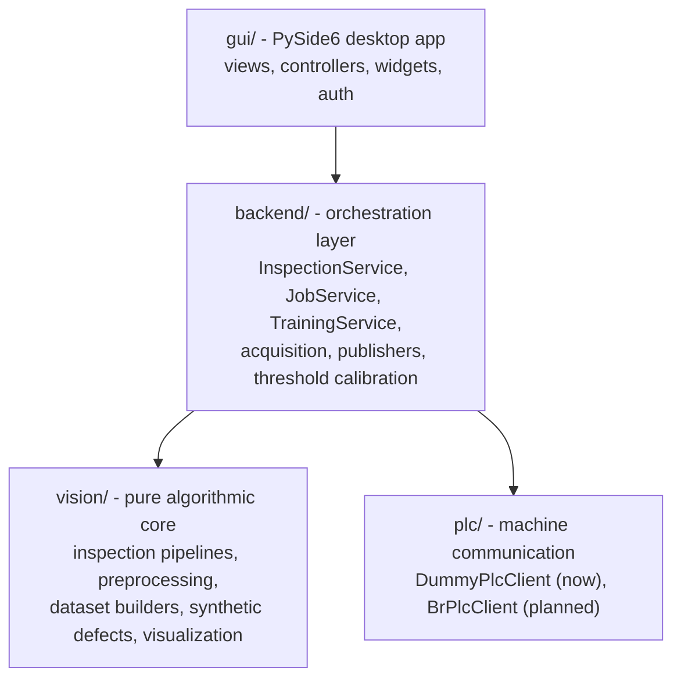
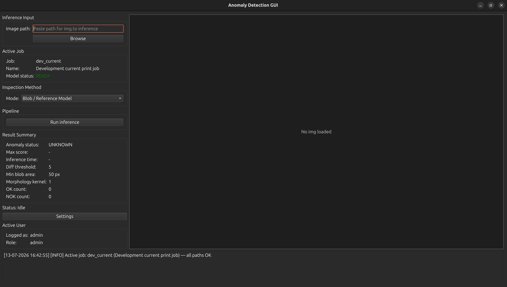
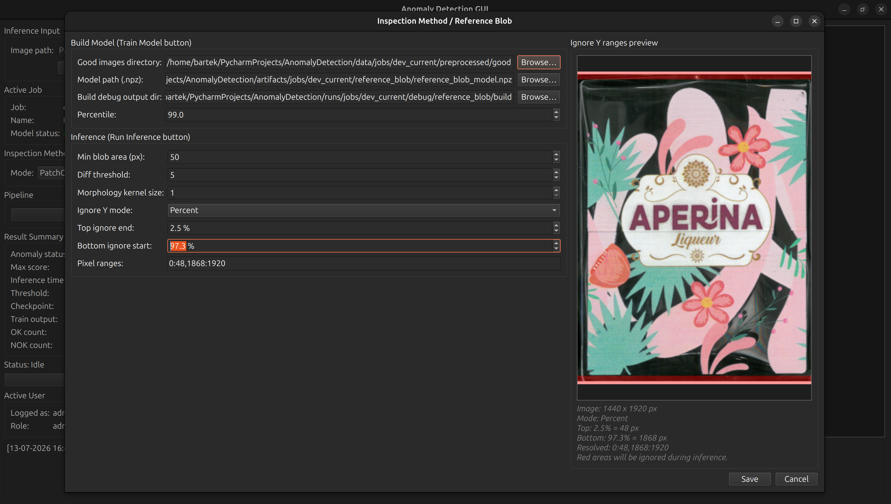
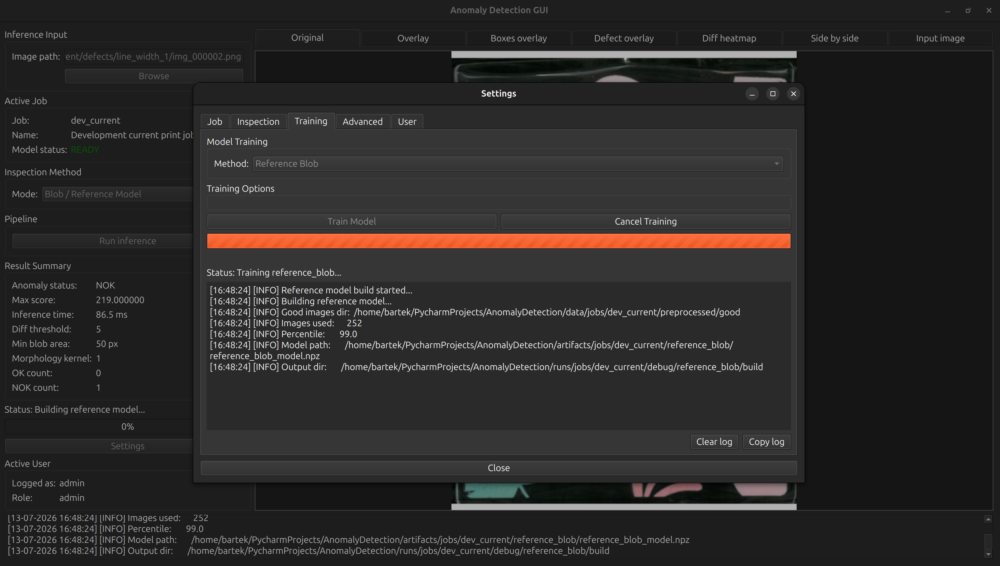
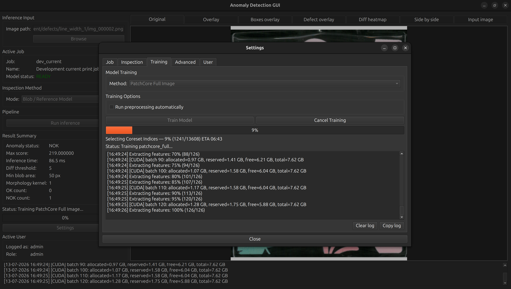
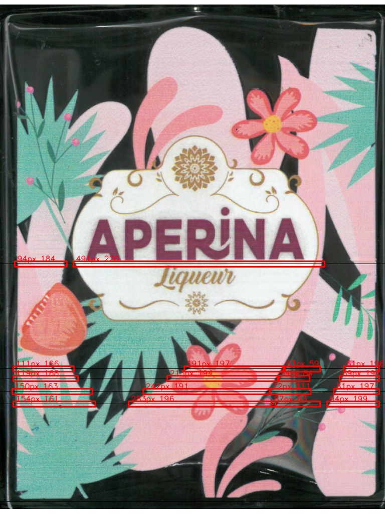
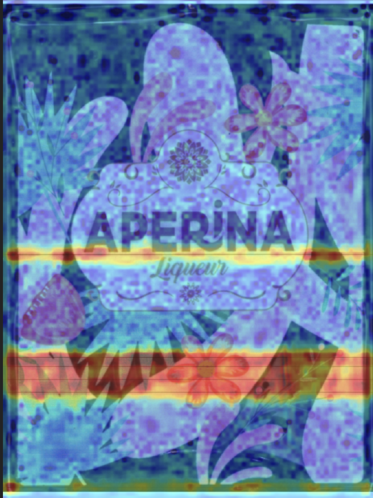
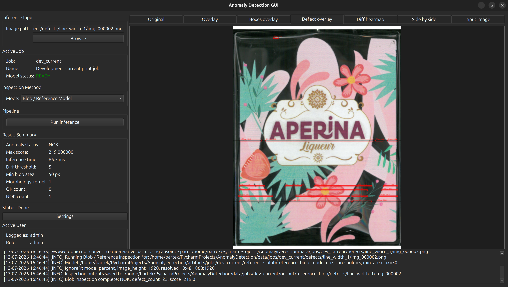
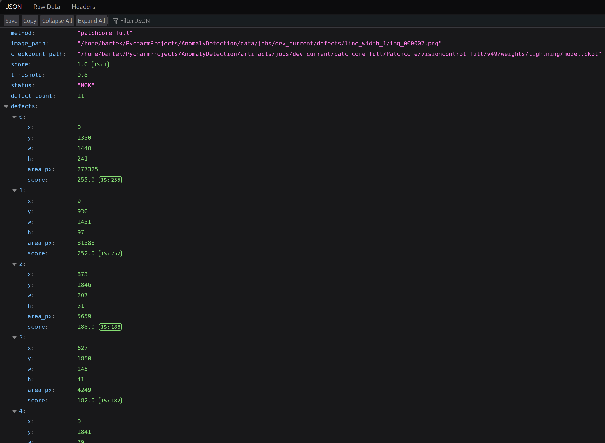

# Bottle Print Quality Inspection - Line-Scan Vision System

[](#)
[](#)
[](#)
[](#)
[](#)
[](#)
[](#)

---

## Project Overview

Printed bottles moving down a production line are scanned by a high-resolution **line-scan camera**, which captures the cylindrical surface one thin strip at a time as the bottle rotates and reconstructs it into a single flattened image. This project is the inspection software that turns those images into a pass/fail decision: is the print on this bottle acceptable, or does it show a defect (missing ink, smearing, streaking, dead-pixel dropouts, discoloration)?

The system is built around one core idea: **inspection method should be swappable without touching anything else**. Two fundamentally different approaches are implemented side by side behind a single interface -

- **PatchCore** (deep learning, via the [Anomalib](https://github.com/openvinotoolkit/anomalib) library) - learns what a "normal" bottle looks like from a set of good images and flags anything that deviates, without ever seeing a labeled defect.
- **Reference Blob** - a classical computer-vision pipeline that builds a statistical reference (median + tolerance) from good images and locates deviations through thresholding, morphology and connected-component analysis.

Both are exposed through the same `InspectionPipeline.inspect()` contract and return the same `InspectionResult` dataclass, so the desktop GUI, the CLI scripts, and any future orchestration layer can treat them interchangeably.

Around the core algorithms sits a small **job-based configuration system**: one active production "job" (product/print recipe) at a time, with a single config file resolving all data, artifact and output paths - so switching between products, datasets or trained models is a configuration change, not a code change.

What a user can do with the current codebase:

- Build a Reference Blob model from a folder of good images and inspect new images against it, with tunable thresholding, morphology, aspect-ratio filtering and false-positive suppression (edge masking, ignore-bands).
- Train a full-image or tiled PatchCore model on good-only data and run inference with heatmap, mask and contour visualizations.
- Generate synthetic defects (stripes, dead pixels, stains) on good images to build labeled test sets without needing real defective samples.
- Drive the whole workflow - dataset prep, training, calibration, inference - from a PySide6 desktop application with login-gated access.

---

## Key Features

- **Two interchangeable inspection methods** - PatchCore (deep learning) and Reference Blob (classical CV) - behind one `InspectionPipeline` interface and one `InspectionResult` output format.
- **PatchCore, tiled and full-image** - full-image inference for global/large-area defects; tiled inference (one model per grid cell) for fine, pixel-level print defects that a single downsampled model would miss.
- **Reference Blob classical pipeline** - per-pixel median template + percentile-based tolerance map, tolerance-compensated differencing, morphological cleanup, connected-component blob extraction, aspect-ratio filtering, optional CLAHE/mean-std normalization and Canny-based edge masking to suppress print-edge ghosting.
- **Shared, typed result contract** - `InspectionResult` / `Defect` dataclasses (status, score, threshold, per-defect bounding boxes, artifacts, metadata) used by every method and by the GUI.
- **Job-based configuration** - one active job (`configs/active_job.yaml` → `configs/jobs/<job_id>.yaml`) resolves every data/artifact/run path; no hardcoded absolute paths in application code.
- **Threshold calibration module** - derives an OK/NOK decision threshold from a distribution of good-image scores (percentile or max strategy), with a calibration report saved for traceability.
- **Reusable training/build services** - `ReferenceModelBuilder`, `PatchcoreFullImageTrainer` and `TrainingService` are used identically from CLI scripts and from GUI background threads, so there is exactly one implementation of each training path.
- **Checkpoint/inference consistency guard** - PatchCore checkpoints store `training_metadata.json` (image size, backbone, layers) so inference automatically uses the exact preprocessing the model was trained with, instead of silently mismatching.
- **CUDA memory safety** - VRAM estimation before training, batch-level CUDA memory logging, and an out-of-memory guard that stops further training attempts in a corrupted CUDA context until the process is restarted.
- **Synthetic defect generation** - stripe, dead-pixel and stain generators for building labeled evaluation data from good images.
- **Desktop GUI with authentication** - PySide6 application with a SQLite-backed login/role system, per-method settings dialogs, a live training-progress panel and a tabbed inference preview (overlay, heatmap, mask, contours).
- **Layered, testable architecture** - `vision/` (pure algorithms) → `backend/` (orchestration: inspection service, job service, training service, acquisition, publishers) → `gui/` (presentation only), with 371 automated tests covering vision logic, backend services and GUI helpers.
- **Pluggable acquisition and publishing** - `AcquisitionSource` (file-based today, line-scan camera SDK later) and `ResultPublisher` (log output today, WebSocket/MQTT/database later) are both abstract interfaces so new I/O channels don't touch inspection logic.
- **PLC integration scaffolding** - `PlcClient` abstraction with a safe `DummyPlcClient` default and a stubbed `BrPlcClient` for a B&R 4PPC70 panel, designed so hardware integration is a drop-in swap rather than a rewrite.

---

## Processing Pipeline

### Reference Blob (classical CV, current fast-path method)

**Build phase - once per job, from N good images**

1. Load good images from the job's `good/` directory (grayscale).
2. Stack all images and compute the **per-pixel median** → the reference template.
3. Compute the **per-pixel Nth percentile of absolute deviation** from the median → the tolerance map (absorbs known scan-to-scan noise, e.g. sub-pixel vibration at high-contrast print edges).
4. Persist the model (`median_template`, `tolerance_map`, `percentile`, `image_count`) to a single `.npz` file.

**Inspection phase - per image**

1. Load the inspected image (grayscale + color) and validate its resolution against the model's.
2. Optional luminance normalization (none / mean-std / CLAHE) applied to both template and image.
3. Compute absolute difference between the normalized image and the normalized template.
4. Subtract the tolerance map from the difference (clipped to `[0, 255]`) → only genuine deviations survive.
5. Zero out configured ignore-bands (`ignore_y_ranges`, `ignore_x_ranges`) for known non-inspectable regions (e.g. cylinder seam, top edge).
6. Optional Canny-edge masking of the template to suppress print-edge ghosting.
7. Threshold the compensated diff, apply morphological open/close, then run 8-connectivity connected-component analysis to extract blobs.
8. Filter blobs by minimum area and aspect ratio; each surviving blob becomes a `Defect(x, y, w, h, area_px, score)`.
9. Decide **OK** (no defects) / **NOK** (one or more defects); build overlay, heatmap and diagnostic artifacts.
10. Return a populated `InspectionResult`.

### PatchCore (deep learning, via Anomalib)

1. Preprocess the dataset - resize/pad good images to a target resolution (multiple of the tile size).
2. **Full-image variant**: train one `Patchcore` model directly on the preprocessed good images (normal-only training, no labeled defects needed).
   **Tiled variant**: split every preprocessed image into a fixed grid (e.g. 4×3) and train one dedicated `Patchcore` model per tile position, so each region of the bottle (label, seam, cap area, …) gets a specialist model.
3. Apply a custom `Resize` + ImageNet `Normalize` pre-processor consistently at both training and inference time (Anomalib checkpoints do not preserve custom pre-processors, so training image size is persisted to `training_metadata.json` and re-applied automatically at inference).
4. Calibrate score/anomaly-map statistics from good images only - full-image via percentile-based threshold calibration; tiled via a per-tile `TileStatsCalibrator` that computes `map_p_low` / `map_p_high` percentiles used to rescale each tile's raw anomaly map into a comparable `[0, 1]` range.
5. At inference: forward the image through the model to get a raw anomaly map, resize it back to the original image resolution (tiled: stitch per-tile maps back into one full-resolution map).
6. Normalize the anomaly map, apply a binary threshold + morphology, and extract defect regions via contour analysis (bounding box, area, max score per region).
7. Compare the image-level score against the calibrated threshold → OK / NOK.
8. Render heatmap, overlay, binary mask and contour visualizations; write a JSON summary alongside them.
9. Return a populated `InspectionResult`.

> Alignment (`reference/alignment.py`) and a rule-based decision engine (`reference/decision_engine.py`) are defined as extension points in the interface but are not yet implemented (`method="none"` / not wired into the pipeline) - see [Future Improvements](#future-improvements).

---

## Architecture

The codebase follows a strict layering rule, enforced by convention and by the module boundaries below:



- **`vision/`** has no knowledge of the GUI or the backend - it is a self-contained algorithm library that takes an `InspectionInput` and returns an `InspectionResult`. `reference/` and `patchcore/` are independent, self-contained sub-packages sharing only the common `base.py` / `result.py` / `visualization.py` contracts.
- **`backend/`** is the orchestration layer: `InspectionService` wires an `AcquisitionSource` → `InspectionPipeline` → `ResultPublisher`/`PlcClient` into one inspection cycle; `JobService` resolves the active job's paths; `TrainingService` drives preprocessing/training/calibration for all three methods from one place, reused by both the GUI and CLI scripts.
- **`gui/`** is presentation only by design - settings dialogs collect parameters, the controller calls into `vision`/`backend`, and results are rendered as-is. The original PatchCore-tiled workflow predates this rule and still calls `vision`/Anomalib directly from `AppController`; `reference_blob` and `patchcore_full` were built against the clean `InspectionPipeline` interface, and migrating the tiled path onto the same interface (via `patchcore/pipeline.py`) is tracked as the next architectural step rather than left implicit.
- **`plc/`** is an isolated, swappable client abstraction - the desktop app runs against `DummyPlcClient` (logs writes, always reports connected) so the rest of the system can be developed and demoed without physical hardware.


---

## Repository Structure

<!-- TREE_START -->
```text
AnomalyDetection/
├── configs/
│   ├── active_job.yaml            # which job is currently active
│   └── jobs/
│       └── dev_current.yaml       # per-job data/artifact/run paths + thresholds
├── data/
│   └── jobs/<job_id>/{good,defects,test}/
├── docs/
│   ├── architecture.md
│   ├── inspection_methods.md
│   └── session_state.md
├── scripts/                       # thin CLI entrypoints only
│   ├── blob/
│   │   ├── build_reference_model.py
│   │   ├── debug_reference_model_blob.py
│   │   └── run_reference_inspection.py
│   ├── dataset/
│   │   ├── build_anomalib_dataset.py
│   │   ├── generate_defects.py
│   │   └── generate_tiles.py
│   └── patchcore/
│       ├── compute_tile_stats.py
│       ├── display_tiled_result.py
│       ├── inference_patchcore_full.py
│       ├── inference_run.py
│       ├── train_patchcore_full.py
│       └── train_patchcore_tiles.py
├── src/anomaly_detection/
│   ├── backend/
│   │   ├── acquisition/           # AcquisitionSource, FileSource (camera source: future)
│   │   ├── jobs/                  # JobConfig, JobLoader, JobService
│   │   ├── publishers/            # ResultPublisher, LogPublisher
│   │   ├── inspection_service.py  # single entrypoint for one inspection cycle
│   │   ├── output_manager.py
│   │   ├── threshold_calibration.py
│   │   └── training_service.py
│   ├── gui/
│   │   ├── auth/                  # SQLite login + role-based permissions
│   │   ├── controllers/           # AppController (GUI workflow orchestration)
│   │   ├── views/                 # main window + per-method settings dialogs
│   │   ├── widgets/                # image viewer, log panel, inference preview tabs
│   │   ├── app_settings.py
│   │   └── main.py
│   ├── plc/                       # PlcClient interface, DummyPlcClient, BrPlcClient (stub)
│   ├── vision/
│   │   ├── dataset/                # dataset + tiling builders
│   │   ├── defects/                # synthetic defect generators (stripes, dead pixels, stains)
│   │   ├── inference/              # tiled inference utilities
│   │   ├── inspection/
│   │   │   ├── patchcore/          # tiled + full-image PatchCore pipelines
│   │   │   ├── reference/          # Reference Blob pipeline (template, blob, normalizer)
│   │   │   ├── base.py             # InspectionPipeline ABC
│   │   │   ├── result.py           # InspectionResult / Defect dataclasses
│   │   │   ├── factory.py          # method-name → pipeline registry
│   │   │   └── visualization.py    # shared heatmap/overlay/contour helpers
│   │   ├── preprocessing/          # resize-with-pad, tiling
│   │   └── visualisation/          # tile stitching, result visualisation
│   └── app_users.db
├── tests/
│   ├── backend/
│   ├── gui/
│   └── vision/
├── environment.yml
├── pyproject.toml
├── pytest.ini
└── README.md
```
<!-- TREE_END -->

---

## Technologies

| Library / Tool | Used for |
|---|---|
| Python 3.10 | Application language, `src/` layout package (`anomaly_detection`) |
| PyTorch | Tensor backend for PatchCore inference and training |
| Anomalib 2.2 | `Patchcore` model, `Folder` datamodule, training `Engine` |
| PyTorch Lightning | Training loop, callbacks (batch progress, cancellation, CPU embedding offload) |
| timm | Backbone feature extractors (ResNet family) used by PatchCore |
| OpenCV | Image I/O, `absdiff`, thresholding, morphology, connected components, Canny, contours, colormaps |
| NumPy | Pixel-array math, percentile-based tolerance/calibration computation |
| PySide6 | Desktop GUI (views, dialogs, widgets, `QThread` background workers) |
| SQLite (stdlib `sqlite3`) | Local user authentication store |
| PyYAML | Job configuration files |
| pytest | Test suite (371 tests across `vision/`, `backend/`, `gui/`) |

---

## Engineering Highlights

- **One contract, many methods.** Every inspection method - regardless of whether it's a neural network or a handful of OpenCV calls - implements `InspectionPipeline.inspect(InspectionInput) -> InspectionResult`. Adding a new method never requires touching the GUI or downstream consumers.
- **Configuration-driven, not path-driven.** All data/artifact/run locations are resolved from `configs/active_job.yaml` + `configs/jobs/<job_id>.yaml` through `JobConfig`/`JobService`; no absolute paths are hardcoded in application code, and switching the active job switches every path consistently.
- **Reusable core, multiple entrypoints.** Training and model-building logic (`ReferenceModelBuilder`, `PatchcoreFullImageTrainer`, `TrainingService`) is written once and used identically by CLI scripts and by GUI background threads - the GUI never re-implements what a script already does.
- **Correctness guards around a known failure mode.** Anomalib checkpoints don't retain the custom preprocessor used at training time; this project explicitly persists `training_metadata.json` (image size, backbone, layers) next to each checkpoint and reloads it automatically at inference, turning a silent accuracy bug into a logged, self-correcting non-issue.
- **Defensive GPU training.** VRAM is estimated before training starts, memory is logged every N batches, and a process-level OOM guard prevents retrying a training run inside a CUDA context already known to be corrupted.
- **Test coverage across every layer.** 371 tests exercise the reference-blob math (template building, blob analysis, defect maps), backend services (job loading, training service, threshold calibration, output manager) and GUI helpers (worker lifecycle, log panel, browse helper) - not just the "happy path" algorithm code.
- **Explicit architectural debt tracking.** The target GUI→backend→vision dependency direction is documented and mostly enforced; the one remaining exception (the original tiled-PatchCore workflow calling `vision` directly from `AppController`) is called out in this README and in `docs/session_state.md` rather than hidden, with a concrete migration path (wrap it behind `patchcore/pipeline.py`).
- **Synthetic data generation for a data-scarce domain.** Real print defects are rare and expensive to collect; the `vision/defects/` generators (stripes, dead pixels, stains) let the pipelines be validated against labeled defect data derived from good images alone.

---

## Future Improvements

- Wrap `TiledInferenceRunner` behind the `InspectionPipeline` interface (`patchcore/pipeline.py`) so all three methods share one code path through `InspectionService`.
- Route the GUI's PatchCore-tiled workflow through `InspectionService` instead of `AppController` calling `vision`/Anomalib directly, completing the GUI→backend→vision migration.
- Implement `reference/alignment.py` (currently a `NotImplementedError` stub) for cases where bottle images are not pixel-aligned to the reference template.
- Implement `reference/decision_engine.py` as a configurable rule-based decision layer (currently the OK/NOK rule is inline in `ReferencePipeline`).
- Replace `FileSource` with a real line-scan camera acquisition source (`AcquisitionSource` is already designed for this swap).
- Implement `BrPlcClient` against a real B&R 4PPC70 panel (OPC UA, Modbus TCP, or a custom TCP protocol - all currently stubbed).
- Add a `WebSocketPublisher` for a browser-based HMI, alongside the existing `LogPublisher`.
- GPU inference optimizations (batching, mixed precision at inference, model quantization) for tighter cycle-time budgets.
- A `hybrid` method that runs Reference Blob first and only escalates to PatchCore when the result is borderline - the fast/explainable path handles most bottles, the model handles the ambiguous ones.

---

## Application Walkthrough

The application provides a graphical interface for configuring inspection jobs, training models, and performing automated print quality inspection. Two complementary inspection methods are available: a configurable **Reference Blob** pipeline based on classical computer vision and a **PatchCore** anomaly detector based on deep learning.

### Main Application

The main window provides access to job management, inspection configuration, model selection, inference execution, and real-time inspection results from a single interface.



---

### Reference Blob Configuration

The Reference Blob pipeline is fully configurable from the GUI. Users can build a reference model from defect-free images, adjust blob detection parameters, define ignored image regions, and tune inspection thresholds without modifying the code.



---

### Reference Model Generation

The reference model is built from multiple defect-free samples. A median template together with a tolerance map is generated and later used for robust pixel-wise comparison during inspection.



---

### Model Training

PatchCore models can be trained directly from the application while monitoring progress, GPU memory usage, and training logs in real time.



---

### Inspection Methods

The application implements two independent inspection approaches.

| Reference Blob (Classical CV) |             PatchCore (Deep Learning)              |
|:-----------------------------:|:--------------------------------------------------:|
|  |  |

The **Reference Blob** pipeline detects defects by comparing the inspected image against a reference model using configurable thresholds, morphology operations and blob analysis.

The **PatchCore** pipeline performs anomaly detection using deep feature embeddings and produces anomaly heatmaps, segmentation masks and localization results.

---

### Inspection Results

Detected defects are visualized directly inside the application together with the final inspection decision and inspection statistics.



---

### Exported Results

Every inspection automatically generates a complete output package containing visualization images together with structured JSON summaries that can be consumed by external systems or used for debugging.


---

## Old demo (out of date)
Approach based on tile processing, which was just the POC

A demo of the project is available [here](https://youtu.be/K-n7jh2-2q8):  
[](https://youtu.be/K-n7jh2-2q8)

## Running the project

```bash
# environment
conda env create -f environment.yml
conda activate vision-system

# tests
PYTHONPATH=src python -m pytest

# desktop GUI
PYTHONPATH=src python -m anomaly_detection.gui.main

# Reference Blob - build model, then inspect
python scripts/blob/build_reference_model.py
python scripts/blob/run_reference_inspection.py --image path/to/bottle.png

# PatchCore - dataset prep, train, inspect
python scripts/dataset/build_anomalib_dataset.py
python scripts/patchcore/train_patchcore_full.py
python scripts/patchcore/inference_patchcore_full.py
```